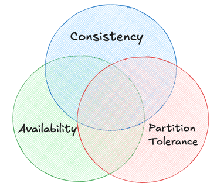
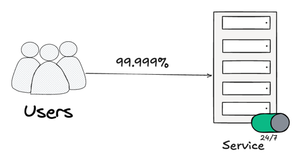
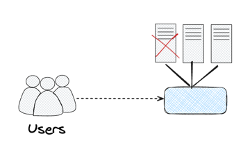

# Pillars of System Design

What makes a good design?
When we are talking about good design, we want to concentrate on few key principles.

1. Scalability:  system should grow with the user-base
2. Maintainability: future developers can understand and improve out current design.
3. Efficiency: making the best use of our resource.
3. Reliability: everything is running smoothly, but maintains composer when things go wrong. 
 
## At the heart of system design there are three key elements:

1. Moving Data: Ensuring data can flow seamlessly from one part of our system to another.
2. Storing Data Not just choosing which database to use for storing the data, but:
   1. Access Patterns 
   2. Indexing Strategies 
   3. Backup Solutions
3. Transforming Data: taking raw data and converting it into meaningful information.

## CAP Theorem / Brewer's Theorem

It is a set of principles that guide us in making informed tradeoffs in three key components of a distributed system:
1. Consistency
2. Availability
3. Partition Tolerance

* Consistency ensures that all the nodes of the distributed system have the same data at the same time. If we make a change to one node, that change should also be reflected on all the nodes.
* Availability means the system is always operational and responsive to requests.
* Partition Tolerance means the system's ability to continue functioning even when disruption occurs in network.
 
#### Availability

Is out system up and running when our users need it? This is often measured in terms of percentage, with 99.999% that means just 5 minutes of downtime per year, if we have let's say 99.9% that still accounts to 8.76 hrs of downtime per year.

We often measure availability in terms of uptime and downtime. Here's is where Service Level Objectives (SLO) and Service Level Agreements (SLA) come to play.

* SLOs are like setting goals for our system's performance and availability. For e.g. we may set out SLOs for 99.9% availability and out service should respond to user requests within 300ms.
* SLAs on the other hand are like a formal contract with our users/customers. They define the minimum level of service we are commiting to provide. For e.g. if we are commiting to 99.99% availability and if it drops below that, then our customers/users are entitled to refunds.

To measure resilience of our system we define following three concepts: Reliability, Fault Tolerance and Redundancy.

- Reliability means the system works correctly and consistently.
- Fault Tolerance is about preparing when things go wrong, how does our system tolerate unexpected failures or attacks.
- Redundancy is about having backups, if one part of our system fails then there is another ready to take its place.

### Speed
We also need to measure the speed of our system, and for that we have Throughput and Latency.
- **Throughput**: how much data our system can handle over a certain period of time. 
- Server Throughput measured using Requests per Second (RPS). A higher RPS value typically indicated better performance the ability to handle more concurrent users.
- Database Throughput measured using Queries per Second (QPS). 
- There is also Data Throughput which is measured using Bytes per Second (B/s)

- **Latency**: how long it takes to handle a single request.