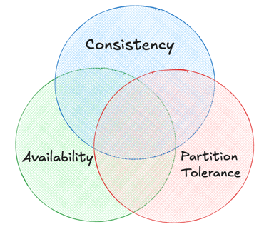

# Pillars of System Design

What makes a good design?
When we are talking about good design, we want to concentrate on few key principles.

1. Scalability:  system should grow with the user-base
2. Maintainability: future developers can understand and improve out current design.
3. Efficiency: making the best use of our resource.
3. Reliability: everything is running smoothly, but maintains composer when things go wrong. 
 
## At the heart of system desgin there are three key elements:

1. Moving Data: Ensuring data can flow seemlessly from one part of our system to another.
2. Storing Data Not just choosing which database to use for storing the data, but:
   1. Access Patterns 
   2. Indexing Strategies 
   3. Backup Solutions
3. Transforming Data: taking raw data and converting it into meaningful information.

## CAP Theorem / Brewer's Theorem

It is a set of principles that guide us in making informed tradeoffs in three key components of a distributed system:
1. Consistency
2. Availability
3. Partition Tolerance

* Consistency ensures that all the nodes of the distributed system have the same data at the same time. If we make a change to one node, that change should also be reflected on all the nodes.
* Availability means the system is always operational and responsive to requests.
* Partition Tolerance means the system's ability to continue functioning even when disruption occurs in network.
